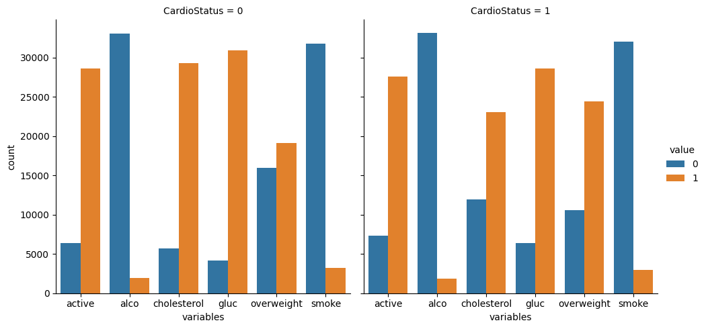
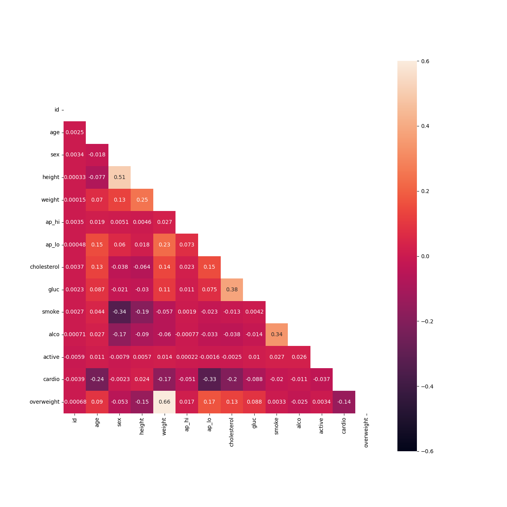

# Medical Data Visualizer
# Medical Examination Data Visualization

## Overview
This project is a hands-on practice exercise to explore data using **Pandas** and visualize patterns with **Seaborn** and **Matplotlib**. The dataset contains medical examination records of patients, allowing analysis of cardiovascular disease indicators in relation to body measurements, blood test results, and lifestyle choices.

## Dataset Description
**File Name:** `medical_examination.csv`

Each row represents a patient, while columns represent various medical attributes:

| Feature | Variable Type | Column Name | Value Type |
|---------|--------------|-------------|------------|
| Age | Objective Feature | `age` | int (days) |
| Height | Objective Feature | `height` | int (cm) |
| Weight | Objective Feature | `weight` | float (kg) |
| Gender | Objective Feature | `gender` | categorical code |
| Systolic Blood Pressure | Examination Feature | `ap_hi` | int |
| Diastolic Blood Pressure | Examination Feature | `ap_lo` | int |
| Cholesterol | Examination Feature | `cholesterol` | 1: normal, 2: above normal, 3: well above normal |
| Glucose | Examination Feature | `gluc` | 1: normal, 2: above normal, 3: well above normal |
| Smoking | Subjective Feature | `smoke` | binary |
| Alcohol Intake | Subjective Feature | `alco` | binary |
| Physical Activity | Subjective Feature | `active` | binary |
| Cardiovascular Disease | Target Variable | `cardio` | binary |

## Project Instructions
The project involves data cleaning, transformation, and visualization:

### 1. Data Processing
- **Import Data**: Load `medical_examination.csv` into a DataFrame (`df`).
- **Calculate Overweight**: Compute BMI (`weight / (height/100)^2`). Assign `1` if BMI > 25, else `0`.
- **Normalize Categorical Variables**: Convert `cholesterol` and `gluc` values (set `0` as good, `1` as bad).
- **Normalize the rest of activities**: Convert all activities with same principle, `0` as good and `1` as bad.

### 2. Categorical Plot
- Use `sns.catplot()` to visualize categorical variables (`cholesterol`, `gluc`, `smoke`, `alco`, `active`, `overweight`).
- Group by `cardio` (presence of cardiovascular disease) and display value counts.
- Save the resulting plot.

### 3. Heatmap Generation
- **Clean Data**: Remove incorrect records where:
  - `ap_lo > ap_hi`
  - Height is outside the 2.5th–97.5th percentile.
  - Weight is outside the 2.5th–97.5th percentile.
- **Correlation Matrix**: Compute and visualize correlations between features.
- **Mask Upper Triangle**: Improve readability by hiding redundant data.
- **Use `sns.heatmap()`** to generate the correlation heatmap.

## Example Visualizations
### Categorical Plot
_Example Chart: Counts of good/bad outcomes for cholesterol, glucose, smoking, alcohol, activity, and overweight_



### Heatmap
_Example Heatmap: Correlation Matrix of Medical Features_



## Technologies Used
- **Python**
- **Pandas**
- **Seaborn**
- **Matplotlib**
- **NumPy**

## Running the Project
To execute the script and generate visualizations:
```bash
python medical_data_visualizer.py
```
This will output the categorical plot and heatmap, saved in the `images/` directory.

## Conclusion
This project provides insights into medical examination data by visualizing relationships between key health indicators and cardiovascular disease risk factors.


