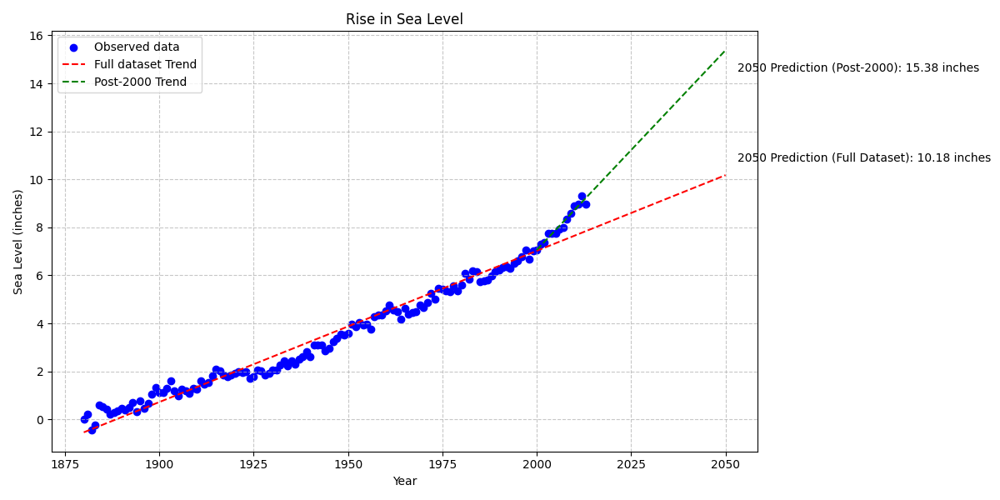

# 🌊 Sea Level Predictor

This project analyzes historical sea level data to predict future changes using linear regression. 📈 The dataset contains **global average sea level changes since 1880**, and we use **Pandas, Matplotlib, and SciPy** to analyze trends and make projections through **2050**.

## 📌 Project Objectives

- Load and visualize sea level data from `epa-sea-level.csv`.
- Create a **scatter plot** of sea level changes over time.
- Use **linear regression** to fit a trend line to the data.
- Make predictions about future sea level rise, extending the trend line to 2050.
- Compare predictions using **all available data** vs. **data from 2000 onward**.

## 📂 Files in This Project

- **`sea_level_predictor.py`** – Main script containing data analysis and visualization.
- **`main.py`** – Runs the project for testing and visualization.
- **`test_module.py`** – Unit tests to validate the implementation.
- **`epa-sea-level.csv`** – Dataset from the **US Environmental Protection Agency** (EPA).

## 📊 Visualization Steps

1️⃣ **Scatter Plot** – Plots sea level data with `Year` on the x-axis and `CSIRO Adjusted Sea Level` on the y-axis. 

2️⃣ **First Regression Line** – Uses all data points to fit a line and predict sea level through 2050.  

3️⃣ **Second Regression Line** – Uses only data from **2000 onwards** for a more recent trend analysis. 
 
4️⃣ **Final Plot** – Displays both trend lines on top of the scatter plot with labels and a title.

## 🔧 Running the Project

Make sure you have all dependencies installed. If using **uv** for dependency management, install requirements with:

```bash
uv pip sync requirements.txt
```

Then, run the project:

```bash
python sea_level_predictor.py
```

## ✅ Expected Outcome

The final visualization will:
- Show the past trend of rising sea levels.
- Predict future sea level changes using **two different regression models**.
- Provide insight into the potential impact of climate change on sea levels.




## 🌍 Data Source
This dataset is sourced from the **US Environmental Protection Agency (EPA)**, compiled from **CSIRO (2015) and NOAA (2015)** records.

---

📢 *Understanding sea level trends is crucial for climate change awareness and future planning!* 🌊🌎

